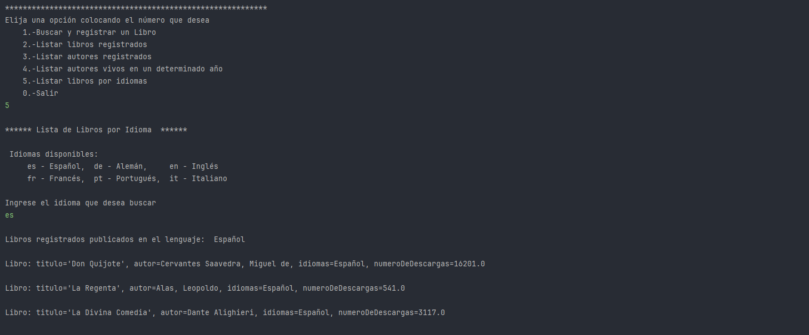

# Encriptador de Texto


## Descripción

El objetivo de este desafío es desarrollar un Catálogo de Libros que ofrezca interacción textual (vía consola) con los usuarios, proporcionando al menos 5 opciones de interacción. 

Los libros se buscarán a través de una API (gutendex). 


## :pencil: Características

- **Encriptación de Texto:** Convierte el texto introducido en un formato encriptado utilizando un conjunto específico de reglas.
- **Desencriptación de Texto:** Permite revertir el texto encriptado a su formato original usando las mismas reglas.
- **Interfaz de Usuario Sencilla:** Diseñada con CSS para ofrecer una experiencia de usuario clara y accesible.
- **Compatibilidad con Navegadores:** Funciona en todos los navegadores modernos.

## Interacciones posibles con el catálogo

Algunas de las posibles interacciones que se podrán realizar en el catálogo de libros son:

1. **Buscar un libro por título.**
2. **Buscar libros por autor.**
3. **Listar todos los libros disponibles.**
4. **Consultar un libro específico.**
5. **Filtrar libros por género o año de publicación.**

---
## Tecnologías utilizadas

- **Java** para el desarrollo principal.
- **Bibliotecas de Consumo HTTP** como `HttpClient`.
- **Librerías para manejar JSON**: `Jackson`.
- **Base de datos**: PostgreSQL.
- **Interacción por consola**.

---
## Requisitos

- **Java** (versión recomendada: 11 o superior).
- Conexión a Internet para realizar las solicitudes a la API de libros.
- Base de datos (**PostgreSQL**).
- Herramientas de desarrollo recomendadas: **IDE de Java** (por ejemplo, IntelliJ IDEA o Eclipse), **Maven** para la gestión de dependencias.

## Pasos para completar el desafío

### 1. **Configuración del Ambiente Java**
Configure un entorno de desarrollo Java, asegurándome de tener todas las herramientas necesarias para trabajar con Java y APIs externas.

### 2. **Creación del Proyecto**
Cree un proyecto en Java donde se integran todos los componentes de la solución: el consumo de la API, el manejo de datos JSON y la base de datos.

### 3. **Consumo de la API**
Realicé solicitudes HTTP a una API externa para obtener información sobre libros. Se utilizarón bibliotecas como `HttpClient` para obtener los datos JSON desde la API.

### 4. **Análisis de la Respuesta JSON**
Una vez que recibas la respuesta en formato JSON, se procedió a analizar los datos usando una biblioteca de parsing de JSON como `Jackson` para extraer los detalles importantes de los libros.

### 5. **Inserción y Consulta en la Base de Datos**
Se configuró una base de datos donde se almacenan los libros y autores obtenidos de la API. 
Posteriormente se realizaron inserciones y consultas para gestionar esta información y para hacer pruebas. 


### 6. **Exhibición de Resultados a los Usuarios**
Se implementó una interacción vía consola donde los usuarios pueden ver un menú con las opciones y ellos puedan realizar las tareas que deseen.

---

## :computer: Ejemplo de uso  y funcionalidades de la Página

La aplicación consta de el siguiente **Menú:** para la interacción con el usuario:


### 1. **Buscar y registrar un libro **
En esta opción podremos buscar buscar un libro a partir de su nombre. si se llega a encontrar en la API este se almacenrá en nuestra base de datos y en la consola se mostrará un mensaje de éxito y los datos del libro.
En la siguiente imaén se muestra el uso de la opción 1 con el libro de : "La Divina Comedia del autor: Dante Alighieri"


### 2. **Listar Libros Registrados**
En está opción el programa nos devolverá los libros que han sido registrados en nuestra base de datos.
En la imagen se observa que ya aparecé el libro anteriormente guardado en el ejemplo anterior.


### 3. **Listar Auotres Registrados**
En está opción el programa nos devolverá los autores de los libros que han sido registrados en nuestra base de datos.
En la imagen se observa que ya aparecé el autor del libro (Dante Alighieri) anteriormente guardado.


### 4. **Listar autores vivo por el año que ingrese el usuario**
En está opción el programa nos devolverá los autores han sido registrados en nuestra base de datos que hayan estado vivos en el año que ingrese el usuario.
En este ejemplo el año ingresado por el usuario es 1940 y aparecen 2 autores vivos en ese año .


### 4. **Listar Libros por idiomas**
En está opción el programa nos devolverá los libros han sido registrados en nuestra base de datos que esten en el idioma que ingrese el usuario.
En este ejemplo el idioma ingresado por el usuario es es= español.



## Uso

1. Clona este repositorio o descarga los archivos.

   ```bash
    git clone https://github.com/AlfredoRosales12/ChallengeLiterAlura

2.Instalar Herramientas de Gestión de Dependencias
Este proyecto usa Maven para la gestión de dependencias. Verifica que tengas instalada esta herramienta.

3.Configura tus variables de entorno.

4. Crea una base de datos

5. Ejecuta el código
java -jar literAlura.jar


## Contribuciones:

Las observaciones, contribuciones,etc.  son bienvenidas. Si encuentras algún error o tienes alguna sugerencia, por favor, abre un issue en este repositorio.

## :copyright: Licencia:

Este proyecto está bajo la licencia OpenSource, Creado por Alfredo Rosales [@AlfredoRosales12](https://github.com/AlfredoRosales12)

¡Diviértete encriptando!

## :iphone: Contact

Te puedes comunicar conmigo a través de los siguientes canales de comunicación:

- [Discord](https://discord.com):
  - `@Alfredo Rosales` Nombre de Usuario
- [LinkedIn][@Alfredo Rosales](https://www.linkedin.com/in/alfredo-rosales-aguilar-5048b0264/)
- [GitHub][@AlfredoRosales12](https://github.com/AlfredoRosales12)
- [Correo Electronico][rosales.alfredo.goo@gmail.com]
 